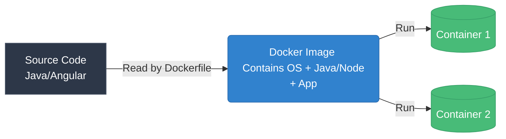
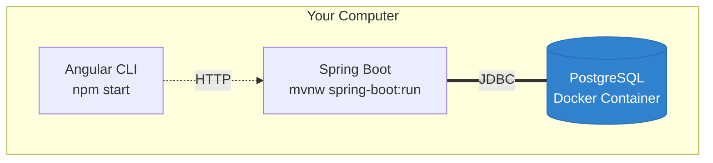
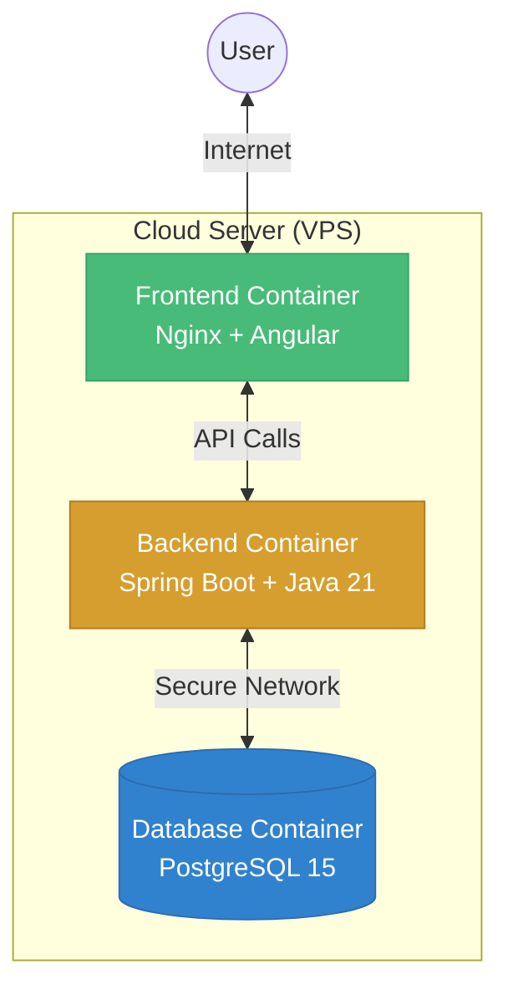
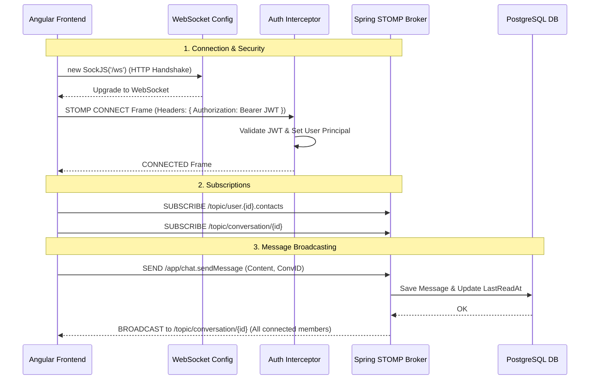
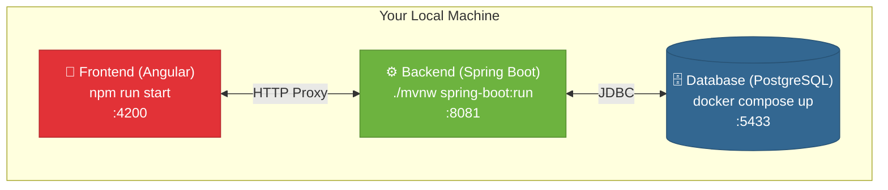
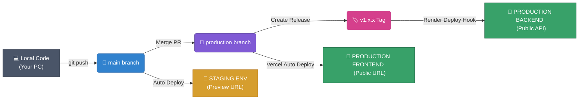
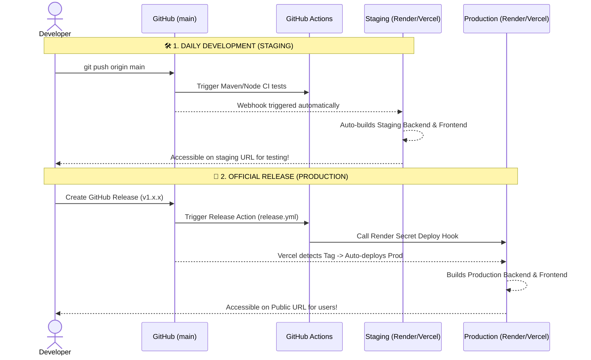

# Time2Wish – Birthday Manager & Reminder 🎂🎉

Time2Wish is a modern and premium web application designed to help you track, organize, and celebrate the birthdays of your social circles (family, friends, colleagues). Featuring an elegant glassmorphism design, interactive sound effects, and advanced management features, it ensures you will never forget a birthday again.

---

## 🎉 Latest Release (v1.7.0) - The "Mobile Multi-Platform & Flutter" Update

In this release, Time2Wish expands into a native multi-platform ecosystem with full iOS, Android, and Flutter mobile capabilities.

### 📱 Angular 21 + Ionic Capacitor 7 Subsystem (`frontend/`)
*   **Android Target (`frontend/android`):** Native Android Gradle project generating installable APK binaries (`app-debug.apk`).
*   **iOS Target (`frontend/ios`):** Native Xcode workspace (`App.xcworkspace`) targeting iOS 14+.
*   **Browser Mobile Preview (`NativeFallbackService`):** Fallback web service allowing 100% functional device testing directly inside Chrome/Edge DevTools Mobile View (Camera file pickers, Web Share API, `navigator.vibrate`, Web Notifications).
*   **Mobile Navigation Bar:** Ergonomic bottom navigation bar (`MobileNavComponent`) with haptic touch feedback and safe-area notch padding (`env(safe-area-inset-top)` / `env(safe-area-inset-bottom)`).

### 💙 Standalone Flutter 3.44 Native Application (`mobile_flutter/`)
*   **Core Architecture:** Flutter 3.44.8 (Dart 3.12.2) standalone app at `mobile_flutter/`.
*   **State & Networking:** `dio` HTTP client with automated JWT Bearer header interceptor, `flutter_secure_storage`, `provider`, and `go_router` declarative navigation.
*   **Glassmorphism Theme:** Material 3 with `GlassCard` backdrop blur widgets, Outfit & Inter Google Fonts, dark/light theme tokens matching web design tokens (`#2563eb` primary, `#7c3aed` accent).
*   **Sprint 1 Completed:** Authentication screens (`LoginScreen`, `RegisterScreen`), Birthdays countdown dashboard (`BirthdayListScreen`), WishCoins header badge, search filter, and bottom navigation shell (`MainNavShell`). Clean code verified with `flutter analyze` (**0 issues found**).

---

## 🎉 Latest Release (v1.6.0) - The "Party Planner & Community Voting" Update

In this release, we've extended the collaborative features of Time2Wish to streamline party organization and gift selection among friends and family.

### 🎈 Party Planner & Shared Tasks
*   **Event Details:** Organizers can now specify the Date, Time, Location, and detailed descriptions for a birthday party directly in the form.
*   **Shared Task Assignments:** Organizers can create a to-do list for the party (e.g., "Bring drinks", "Buy balloons"). Guests accessing the public shared link can anonymously self-assign these tasks to help out, easing the burden on the organizer.
*   **Anonymous Persistent Tracking:** Guest actions on the public link are tracked via an intelligent, on-the-fly local session identifier (`sessionId`), ensuring guest anonymity while maintaining consistency.

### 👍 Community Gift Voting
*   **Interactive Wishlist:** The shared public wishlist now features an interactive Up/Down voting system.
*   **Democratic Selection:** Guests can vote on which gifts they think are the best, helping the community decide what to buy together or individually.

### 💰 Admin Panel Enhancements
*   **Dynamic Affiliate Links:** Administrators can now manually configure and update the Amazon Affiliate Tag (`AMAZON_AFFILIATE_TAG`) directly from the "Centre de Commandement", allowing seamless monetization of AI-suggested gifts.

---

## 🎉 Previous Release (v1.5.0) - The "Ultra-Premium Command Center" Update

In this major update, we've revolutionized the administration panel by introducing a real-time, ultra-premium Command Center to give administrators absolute control and unparalleled visibility into the system.

### 🛡️ Command Center & Live Telemetry
*   **Live Server Monitor (WebSockets):** A built-in terminal directly in the web UI streams real-time backend logs using WebSockets. It also features dynamic progress bars for tracking JVM RAM consumption and CPU load.
*   **Modular Kill Switches:** Emergency toggle switches to instantly disable specific modules (AI Wishes, AI Images, Chat, Crowdfunding) globally for all users without restarting the server.
*   **Live User Tracker:** Real-time counter powered by Spring WebSockets displaying the exact number of users currently connected to the platform.
*   **Ghost Login (Impersonation Mode):** Administrators can generate a secure, temporary JWT to instantly log in "as" any user with a single click, perfect for troubleshooting user-specific issues.
*   **Database Snapshots:** A one-click backup utility that instantly extracts all critical PostgreSQL data into a downloadable JSON file.

---

## 🚧 Upcoming Update - Support & Feedback Loop

In future releases, we plan to further enhance user-admin interactions:
*   **Collaborative E-Cards:** Allow multiple guests to sign a digital birthday card before revealing it to the recipient.
*   **Memory Lane (Digital Guestbook):** A dedicated space to upload memories, photos (up to 5MB), and messages.
*   **Support Tickets:** Users can open support requests directly from the app.
*   **Global Announcements:** Broadcast "Information" or "Warning" banners to all users.
*   **AI Statistics Tracking:** Visual charts tracking AI usage across the platform.
*   **User Feedback System:** 5-star rating system to gather user feedback.

---

## 🎉 Latest Release (v1.4.1) - The "Global Messaging Hub"

## 🎉 Latest Release (v1.4.0) - The "Social & Crowdfunding" Update

In this release, we've transformed Time2Wish into a truly collaborative platform by introducing real-time social features and crowdfunding capabilities for gifts.

### 💬 Social & Collaborative Features
*   **Real-time Private Chat (WebSockets):** Guests can now chat together directly on the secret birthday link. The chat is fully real-time and powered by Spring WebSockets (STOMP) and Angular.
*   **Integrated Crowdfunding (Cagnottes):** For each suggested or manual gift, users can launch a funding pledge ("Cagnotte"). Contributors can promise a specific amount and leave a message.
*   **Live Progress Tracking:** The UI dynamically updates the progress bar for the gift based on real-time contributions from the community.

---

## 🎉 Previous Release (v1.3.0) - The "Premium Limitations & Quotas" Update

In this release, we've implemented the comprehensive subscription model and its associated AI quotas to balance the load and provide a premium experience.

### 🔒 Core Features & Limitations
*   **AI Rate Limiting (Backend):**
    *   **BASIC Plan:** 1 AI Birthday Wish generation per week. AI Gift ideas are locked.
    *   **PLUS Plan:** 1 AI Gift generation per month. AI Wishes are unlocked.
    *   **PREMIUM Plan:** Unlimited AI generation.
*   **WishCoins Currency (New!):** Users now have a visible wallet of WishCoins in the navigation bar. These virtual tokens clarify the exact cost and remaining balance for AI-powered actions (gift generation, e-cards, etc.), seamlessly integrated with the billing plans.
*   **Dynamic Countdowns:** The UI now displays a dynamic countdown for AI features when the quota is reached, keeping the user informed of when their next generation is available.
*   **Dashboard Enhancements:** Advanced dashboard statistics (Charts) are now exclusively available for PREMIUM users, utilizing an elegant glassmorphism blur overlay (`.locked-chart`) to tease the feature.
*   **Contact Profile Restrictions:** 
    *   BASIC users can only set reminders for D-Day and are limited to 3 favorite contacts.
    *   Custom photo uploads are now locked behind the PLUS plan.
*   **Gift Management:** Complete CRUD interface added for manual gift management within the detailed birthday view.
*   **Bug Fix:** Resolved the "Page Blanche" staging issue on Vercel caused by Angular 17+'s new `dist/frontend/browser` output directory architecture.

---

## 🛠️ Project Architecture

**Architecture Type:** **Containerized Monolithic REST API with a Standalone SPA (Single Page Application)**.
The project is built on a modern decoupled client-server model communicating via HTTP REST, using secure stateless authentication. It is fully containerized using Docker for seamless deployments.

The system is split into the following layers:

### 1. `backend/` — Spring Boot 3.x & Java 21
*   **Architecture:** Monolithic REST API.
*   **Security:** Stateless JWT authentication with HTTP-Only Refresh Token Cookies and Bearer Access Tokens. See [Authentication Flow](#-authentication--session-management) below.
*   **AI Integration:** Services using Pollinations.ai for free, zero-configuration Text and Image generation.
*   **Task Scheduling:** Cron jobs for daily checks and reminder email dispatches via SMTP.

### 2. `frontend/` — Angular 18+ & Node 20
*   **Architecture:** SPA (Single Page Application) / PWA.
*   **State Management:** Reactive architecture using modern **Angular Signals** instead of RxJS for local state.
*   **Design:** Custom Glassmorphism UI (Vanilla CSS/SCSS) focused on premium aesthetics and animations.
*   **Session Persistence:** Access Token and User Profile stored in `localStorage` for instant session restoration on page reload.
*   **Security:** Auto-logout after 10 minutes of inactivity with user notification.

### 3. `database/` — PostgreSQL 15+
*   **Architecture:** Relational Database.
*   **Migrations:** Managed seamlessly via Flyway scripts (`db/migration`).

### 4. `DevOps & CI/CD` — Docker & GitHub Actions
*   Multi-stage Dockerfiles for both Frontend and Backend to keep images lean.
*   `docker-compose.yml` for unified local/production deployments.
*   Automated CI/CD pipelines via GitHub Actions and GitLab CI configurations.

### Project Structure
```
time2wish-ai/
├── backend/                      # Spring Boot REST API
│   ├── src/main/java/app/time2wish/
│   │   ├── controller/           # REST Controllers (Auth, Birthday, Admin, AI)
│   │   ├── dto/                  # Data Transfer Objects (requests/responses)
│   │   ├── model/                # JPA Entities (User, Birthday, RefreshToken)
│   │   ├── repository/           # Spring Data JPA Repositories
│   │   ├── security/             # JWT Filter, Guard, Config (WebSecurityConfig)
│   │   └── service/              # Business Logic (Gemini, HuggingFace, Email)
│   └── src/main/resources/
│       ├── application.yml       # App configuration (DB, JWT, SMTP, AI keys)
│       └── db/migration/         # Flyway SQL migration scripts (V1 to V8)
├── frontend/                     # Angular 18+ SPA
│   ├── src/app/
│   │   ├── components/           # Reusable UI components (toast, modals, etc.)
│   │   ├── guards/               # Route guards (auth.guard.ts)
│   │   ├── interceptors/         # HTTP interceptors (auth.interceptor.ts)
│   │   ├── models/               # TypeScript interfaces
│   │   ├── pages/                # Page components (login, dashboard, etc.)
│   │   └── services/             # Angular services (auth, birthday, translation)
│   ├── src/environments/         # Environment configs (dev / prod)
│   ├── proxy.conf.json           # Dev proxy (forwards /api to backend:8081)
│   └── angular.json              # Angular CLI configuration
├── .github/workflows/            # GitHub Actions CI/CD pipelines
├── .gitlab-ci.yml                # GitLab CI/CD pipeline (alternative)
├── docker-compose.yml            # Production Docker Compose
├── docker-compose.dev.yml        # Development Docker Compose (DB only)
└── README.md
```

---

## 🐳 Docker & Containerization Strategy

Time2Wish heavily relies on **Docker** to ensure the application runs identically on any computer, whether it's your local development machine or a production server in the cloud.

### Why do we use Docker?
Before Docker, a developer had to manually install Java, Node.js, and PostgreSQL on their computer. If the server had a different version of Java, the app might crash ("It works on my machine" problem).
Docker solves this by packaging the application and its exact dependencies into an isolated box called a **Container**.

### 1. Dockerfile (The Recipe)
A `Dockerfile` is a text file that acts as a step-by-step recipe to build a Docker Image. We have one for the backend and one for the frontend.



**Advantages of our Multi-Stage Dockerfiles:**
- **Lean Images:** We build the app in a "Builder" stage (which contains heavy tools like Maven/NPM), but we only copy the final compiled files into the "Runner" stage. This keeps our production images extremely lightweight and fast to deploy.
- **Security:** We create a restricted `appuser` so the container doesn't run as `root`.

### 2. Docker Compose (The Orchestra Conductor)
While a `Dockerfile` builds a single app, our project has three parts: Frontend, Backend, and Database. `docker-compose.yml` is the script that connects them all together.

#### How it is used in Development (`docker-compose.dev.yml`)
During development, we only use Docker to run the PostgreSQL database. This allows us to run the Backend (from IntelliJ/Eclipse) and Frontend (via `npm start`) locally for fast hot-reloading.



#### How it is used in Production (`docker-compose.yml`)
When deploying to a VPS (Virtual Private Server), `docker-compose.yml` spins up the entire stack in isolated networks. The frontend container talks to the backend container, and the backend talks to the database, without exposing the database to the internet.



*(Note: In our Free-Tier Cloud deployment via Render and Vercel, we don't use `docker-compose`. Instead, Render builds our Backend `Dockerfile` directly, and Vercel builds our Frontend natively.)*

---

## 🔐 Authentication & Session Management

Time2Wish uses a **stateless JWT-based authentication** system. Here is the complete lifecycle of a user session, from login to logout:

### Login Flow
```
┌──────────┐         ┌──────────────┐         ┌──────────────┐
│ Frontend │         │   Backend    │         │  PostgreSQL  │
└────┬─────┘         └──────┬───────┘         └──────┬───────┘
     │  POST /api/auth/login │                       │
     │  {email, password}    │                       │
     │──────────────────────>│                       │
     │                       │  Verify credentials   │
     │                       │──────────────────────>│
     │                       │  User found ✓         │
     │                       │<──────────────────────│
     │                       │                       │
     │                       │  Generate JWT (15min)  │
     │                       │  Generate RefreshToken │
     │                       │  Store RefreshToken ──>│
     │                       │                       │
     │  Response:            │                       │
     │  - JWT in body        │                       │
     │  - RefreshToken in    │                       │
     │    HTTP-Only Cookie   │                       │
     │<──────────────────────│                       │
     │                       │                       │
     │  Store JWT + Profile  │                       │
     │  in localStorage      │                       │
     └──────────────────────────────────────────────────
```

1. **User submits** email + password on the login page.
2. **Backend validates** credentials via `AuthenticationManager` (BCrypt password hashing with 12 rounds).
3. **Backend generates** two tokens:
   - **Access Token (JWT)**: Short-lived, signed with `JWT_SECRET` (HS512 algorithm). Sent in the **response body**.
   - **Refresh Token (UUID)**: Long-lived (30 days), stored in the database (`refresh_tokens` table). Sent as an **HTTP-Only cookie** (`t2w_refresh`).
4. **Frontend stores** the Access Token and User Profile in `localStorage` (`t2w_access_token` and `t2w_user_profile` keys) and updates Angular Signals.

### Authenticated Requests
```
Every API call:
  ┌──────────┐                          ┌──────────────┐
  │ Frontend │  GET /api/birthdays      │   Backend    │
  │          │  Authorization: Bearer   │              │
  │          │  eyJhbGciOiJIUzUxMi...   │              │
  │          │─────────────────────────>│              │
  │          │                          │ AuthTokenFilter
  │          │                          │ validates JWT │
  │          │  200 OK + data           │              │
  │          │<─────────────────────────│              │
  └──────────┘                          └──────────────┘
```

- The `authInterceptor` (Angular HTTP Interceptor) automatically attaches the `Authorization: Bearer <JWT>` header to every outgoing HTTP request.
- The `AuthTokenFilter` (Spring Security filter) intercepts every incoming request, validates the JWT signature and expiration, and sets the `SecurityContext`.

### Page Refresh (Session Persistence)
```
User presses F5:
  ┌──────────────────────────────────────────┐
  │ Angular App Restart                      │
  │                                          │
  │ 1. AuthService constructor:              │
  │    accessToken = localStorage.get(...)   │  ← Instant restore
  │    currentUser = localStorage.get(...)   │  ← Instant restore
  │    isAuthenticated = true ✓              │
  │                                          │
  │ 2. APP_INITIALIZER → refreshSession():   │
  │    POST /api/auth/refresh (background)   │  ← Get fresh token
  │    If success → update token             │
  │    If fail → keep existing token         │
  │                                          │
  │ 3. Auth Guard checks isAuthenticated()   │
  │    → true → Dashboard loads normally ✓   │
  └──────────────────────────────────────────┘
```

- On page reload, the Angular app is destroyed and recreated from scratch.
- The `AuthService` signals are initialized **synchronously** from `localStorage`, so `isAuthenticated()` returns `true` immediately.
- The `APP_INITIALIZER` calls `refreshSession()` in the background to get a fresh JWT, but **does not block** the app if it fails.
- The `authGuard` sees `isAuthenticated() = true` and allows navigation to protected routes.

### Auto-Logout (10 Minutes Inactivity)
```
  ┌─────────────────────────────────────────────┐
  │ App Component (@HostListener)               │
  │                                             │
  │ Listens: mousemove, keydown, click,         │
  │          scroll, touchstart                 │
  │                                             │
  │ On activity → reset 10-min timer             │
  │ On timeout  → logout() + redirect to        │
  │               /login?reason=timeout         │
  │                                             │
  │ Login Page reads ?reason=timeout:            │
  │ → Shows warning toast in user's language    │
  │   (FR/EN/DE)                                │
  └─────────────────────────────────────────────┘
```

### Logout Flow
1. Frontend calls `POST /api/auth/logout`.
2. Backend deletes the Refresh Token from the database and clears the HTTP-Only cookie.
3. Frontend clears `localStorage` (`t2w_access_token` + `t2w_user_profile`) and resets all Signals to `null`.
4. User is redirected to `/login`.

### Security Summary

| Layer | Mechanism | Purpose |
|-------|-----------|---------|
| Password Storage | BCrypt (12 rounds) | Prevents password cracking |
| Access Token | JWT (HS512, short-lived) | Stateless API authentication |
| Refresh Token | UUID in HTTP-Only Cookie | Secure silent token renewal |
| Session Persistence | localStorage (token + profile) | Survives page refresh |
| Inactivity Guard | 10-min idle timer (global `@HostListener`) | Auto-logout protection |
| CORS | Whitelisted origins + `allowCredentials` | Cross-origin protection |
| CSRF | Disabled (stateless JWT, no server-side sessions) | Not applicable |
| XSS | Angular built-in template sanitization | Template injection prevention |

---

## 💬 Global Real-Time Messaging Architecture

Time2Wish features a fully integrated, real-time messaging system allowing 1-to-1 and group chats. Here is how the technology stack powers this experience:

### Technology Stack
*   **Protocol:** WebSocket with STOMP (Simple Text Oriented Messaging Protocol) as the sub-protocol.
*   **Backend:** Spring Boot WebSocket (`spring-boot-starter-websocket`) with a Simple In-Memory Message Broker.
*   **Frontend:** `@stomp/stompjs` and `sockjs-client` providing fallback mechanisms and reactive Angular Signals for instant UI updates.

### Architecture & Connection Flow



1. **Initial Handshake (SockJS):** The Angular frontend establishes a connection via `new SockJS('/ws')`. Due to Spring Security, traditional HTTP headers (like `Authorization`) are not easily passed in browser WebSockets. We explicitly bypass HTTP-level security for `/ws/**` in `WebSecurityConfig`.
2. **STOMP CONNECT Frame:** The frontend sends the JWT Bearer token inside the STOMP `CONNECT` frame headers (`connectHeaders: { Authorization: 'Bearer ...' }`).
3. **Security Interception:** The backend uses a custom `ChannelInterceptor` (`WebSocketAuthInterceptor`) to intercept the STOMP `CONNECT` command, extract the JWT, validate it, and assign a `Principal` to the WebSocket session.
4. **Subscription (Frontend -> Backend):** 
   - Upon connection, the user globally subscribes to their private notification channel: `/topic/user.{userId}.contacts`.
   - When opening a conversation, the user subscribes to `/topic/conversation/{conversationId}`.
5. **Message Broadcasting (Backend -> Frontend):**
   - **Chat Messages:** Sent via `@MessageMapping("/chat.sendMessage")` and broadcasted by the `SimpMessagingTemplate` to all connected clients on `/topic/conversation/{id}`.
   - **System Notifications:** Contact requests and validations trigger automatic backend pushes to `/topic/user.{userId}.contacts`, which forces the frontend to seamlessly reload contact lists without refreshing the page.

### Features
*   **Instant Unread Counters:** The system intelligently tracks `lastReadAt` timestamps per user in the database. Senders do not increment their own unread counts.
*   **Auto-Reconnect:** The STOMP client automatically attempts to reconnect if the connection drops.
*   **Contextual Birthday Groups:** Users can instantly create dedicated group chats pre-filled with the guests of a specific birthday.

---

## 🚀 Key Features

1.  **Reactive Dashboard:** Clear visualization with stats (total, today, this month, next 30 days) and advanced filters (text search, categories, month).
2.  **Triple View Modes:** Grid mode (polished graphic cards), List mode (professional `Mat-Table` with sorting and pagination), and **Calendar View** (monthly calendar grid showing birthdays).
3.  **AI-Powered Wish Generator:** Generate personalized birthday wishes using Pollinations.ai, specifying tones (Friendly, Funny, Formal, Poetic) and custom instructions.
4.  **AI Card Generator:** Generate custom birthday card images using Pollinations.ai directly.
5.  **Custom Message Templates:** A complete template management system to save, edit, and reuse your favorite birthday messages.
6.  **Rich Contact Profiles:** Full contact support with Email, WhatsApp integration, profile image uploads, and customizable age display toggles.
7.  **Data Management:** Easily import and export your birthdays from/to CSV files, or export them to standard yearly recurring iCal `.ics` files for Google Calendar, Outlook, and Apple Calendar.
8.  **Live Toast Alerts:** Non-blocking real-time feedback notifications for all actions (add, update, delete, and import).
9.  **Notification Center (Bell):** Individual profile tracking of action history (adds, updates, deletions) with custom bell-ringing animations.
10. **Native Audio Synthesis:** Melodious sound feedback triggered on success and deletion actions.
11. **Advanced User Profiles:** Dedicated settings page to manage personal information (Name, Bio, Avatar) and securely change passwords.
12. **Interactive Analytics:** Dashboard integrations featuring dynamic Chart.js visualizations (Donut charts for categories, Bar charts for birth months).
13. **Progressive Web App (PWA):** Installable on mobile and desktop devices with offline caching via Angular Service Workers.
14. **SMTP Email Integration:** Automated reminder emails sent out via a real SMTP server integration using Spring Boot Mail.
15. **Astrology & Zodiac:** Automatic calculation and display of Zodiac signs based on birthdates across all dashboard views.
16. **Interests Management:** Seamlessly add and manage tags for personal interests within the contact details to keep track of their hobbies.
17. **Gift Management & Secret Sharing:** Leverages AI (with a smart local fallback engine) to generate personalized gift suggestions based on age, gender, category, and interests. Users can save gifts to a personal wishlist and generate a secure, public **Secret Sharing Link**. Friends and family can use this link to view the wishlist and anonymously reserve gifts without needing an account.
18. **Internationalization (i18n):** Full support for French, English, and German languages with dynamic switching.

---

## 📥 Quick Start Guide

### 💻 Local Development Architecture



### Prerequisites
*   **Java 21** or higher.
*   **Node.js 18** or higher (with npm).
*   **Docker & Docker Compose** (for the local database).

### 1. Launching the Database
From the project root, launch PostgreSQL in the background:
```bash
docker compose -f docker-compose.dev.yml up -d
```

### 2. Running the Backend
Navigate to the `backend/` directory, configure your JDK path, and run the app:
```bash
cd backend
# On Windows PowerShell:
$env:JAVA_HOME = "C:\Program Files\Java\jdk-21"
./mvnw.cmd spring-boot:run

# On Linux/macOS:
export JAVA_HOME=/usr/lib/jvm/java-21
./mvnw spring-boot:run
```
*The backend server will run on port `8081`.*

### 3. Running the Frontend
Navigate to the `frontend/` directory, install dependencies, and start the development server:
```bash
cd frontend
npm install
npm run start
```
*The frontend application will be accessible at `http://localhost:4200`.*

> **Note:** In development, the Angular dev server uses a **proxy** (`proxy.conf.json`) to forward all `/api` requests to the backend on port 8081. This ensures cookies and credentials work seamlessly across ports.

---

## 🌍 Free-Tier Cloud Deployment Guide (Staging & Production)

Time2Wish utilizes a professional dual-environment strategy using free-tier Cloud PaaS providers:
- **Staging Environment (Test):** Automatically updated every time code is pushed to the `main` branch.
- **Production Environment (Public):** 
  - **Frontend:** Updated when code is merged into the `production` branch.
  - **Backend:** Updated when an official **GitHub Release** (Tag) is created.

### ⚙️ The Automated GitOps Workflow

#### 1. Environments Pipeline



#### 2. Technical Sequence

Here is exactly what happens under the hood:



### 🛠️ Architecture Setup

We utilize a decoupled architecture with the following services:
- **Database:** [Neon.tech](https://neon.tech/) (Serverless PostgreSQL)
- **Backend:** [Render.com](https://render.com/) (Spring Boot Docker Container)
- **Frontend:** [Vercel.com](https://vercel.com/) (Angular SPA)

### Step 1: Database Setup (Neon.tech)
1. Create a free account on [Neon.tech](https://neon.tech/) and a new PostgreSQL project (e.g., `time2wish-db`).
2. **Branching:** In Neon, create two branches: `staging` and `production`.
3. Note down the secure SSL connection details for both branches.
   - Example Host: `ep-lucky-sound-ahfimxig-pooler.c-3.us-east-1.aws.neon.tech`

### Step 2: Backend Deployment (Render.com)
You need to create **two** Web Services connected to your GitHub repository (Directory: `backend`, Environment: `Docker`).

**A. Staging Backend (`time2wish-backend-staging`)**
1. Set to deploy automatically on the `main` branch.
2. **Environment Variables:**
   - `DB_HOST` = `<your-neon-staging-host>`
   - `DB_OPTIONS` = `?sslmode=require`
   - `SPRING_PROFILES_ACTIVE` = `prod`

**B. Production Backend (`time2wish-backend-prod`)**
1. Set to deploy on the `main` branch, but **disable Auto-Deploy**.
2. **Environment Variables:**
   - `DB_HOST` = `<your-neon-production-host>`
   - `DB_OPTIONS` = `?sslmode=require`
   - `SPRING_PROFILES_ACTIVE` = `prod`
3. **Deploy Hook:** Copy the Render Deploy Hook URL. Add this URL as a repository secret in GitHub named `RENDER_DEPLOY_HOOK_PROD`. Our GitHub Actions workflow (`release.yml`) will call this URL automatically when you publish a Release!

### Step 3: Frontend Deployment (Vercel.com)
1. Go to [Vercel.com](https://vercel.com/) and import your GitHub repository (Root Directory: `frontend`).
2. Go to **Settings > Git** and change the **Production Branch** to `v*` or `production`. This ensures `main` pushes become Preview/Staging deployments.
3. Because we have two backends, we use environment variable injection for the API URL. Go to **Settings > Environment Variables** and add:
   - For **Production** environment: `API_URL` = `https://time2wish-backend-prod.onrender.com/api`
   - For **Preview** environment: `API_URL` = `https://time2wish-backend-staging.onrender.com/api`
4. Change your Build Command in Vercel to `npm run build:vercel`. This script automatically replaces the `/api` endpoint in `environment.prod.ts` with the provided `API_URL`.

*(Note: Ensure your `vercel.json` proxy rewrites are removed or configured to handle full URLs if you rely on the proxy for CORS. Currently, the backend CORS is configured to allow `https://*.vercel.app`, allowing direct API calls from the frontend.)*

---

### 🤖 Step 4: External API Configuration (Email)

To fully unlock the application's features, you need to provide an SMTP server for the reminder emails. Add these as **Environment Variables** in your Render Web Services (Staging and Production).

*(Note: The AI text and image generation features use Pollinations.ai and are 100% free and require zero configuration or API keys!)*

#### 3. Free SMTP Email Provider (Resend)
We recommend **Resend** as it is a modern, developer-friendly email API offering a generous free tier of **3,000 emails per month**.
1. Create a free account on [Resend.com](https://resend.com/).
2. Go to **API Keys** and create a new key. This key will act as your SMTP password.
3. In Render, add the following variables:
   - `SMTP_HOST` = `smtp.resend.com`
   - `SMTP_PORT` = `465`
   - `SMTP_USER` = `resend`
   - `SMTP_PASSWORD` = `your_resend_api_key`

---

### ⚠️ Deployment Troubleshooting & Known Solutions

During deployment, we encountered and resolved several issues. Here are the detailed explanations and solutions:

#### 1. Backend Crash: `StorageException: Could not initialize storage`
- **Problem:** Render runs Docker containers as a non-root user (`appuser`) for security. Our backend tries to create an `uploads/` directory inside `/app` on startup, resulting in a permission denied error because `/app` was owned by `root`.
- **Solution:** We modified the backend `Dockerfile` to change the ownership of the working directory before switching to the restricted user.
  *Code Change in `Dockerfile`:*
  ```dockerfile
  # Create a non-root user for security
  RUN addgroup -S appgroup && adduser -S appuser -G appgroup
  
  # Change ownership so the non-root user can create storage directories
  RUN chown -R appuser:appgroup /app
  
  USER appuser
  ```

#### 2. Frontend Build Error: `Conflicting peer dependency` on Vercel
- **Problem:** NPM strict peer dependency resolution fails on Vercel because `@angular/service-worker` version was strictly set to `^21.2.16` while `@angular/core` and `@angular/build` were at `^21.2.13`.
- **Solution:** We manually aligned the versions in `package.json` to match the builder and regenerated the `package-lock.json`.
  *Code Change in `package.json`:*
  ```diff
  - "@angular/service-worker": "^21.2.16",
  + "@angular/service-worker": "^21.2.13",
  ```

#### 3. Vercel Deployment Succeeds but shows `404 NOT_FOUND`
- **Problem:** In Angular 17/18 using the new `@angular/build:application` builder, the output directory defaults to `dist/<project-name>/browser`. Because `outputPath` was missing in our `angular.json`, Vercel didn't know where to find the compiled HTML/JS files and served an empty directory.
- **Solution:** We explicitly defined the `outputPath` in `frontend/angular.json`.
  *Code Change in `angular.json`:*
  ```json
  "architect": {
    "build": {
      "builder": "@angular/build:application",
      "options": {
        "outputPath": "dist/frontend",
        "browser": "src/main.ts"
  ```
  *(Note: Vercel automatically appends `/browser` when it detects the application builder).*

#### 4. White Screen after Vercel Deployment (JS files failing to load)
- **Problem:** To handle SPA (Single Page Application) routing, we initially added a fallback rewrite (`"source": "/(.*)", "destination": "/index.html"`) in `vercel.json`. However, Vercel intercepted requests for static files (like `main.js`), returning the HTML of `index.html` instead. This caused a `SyntaxError` in the browser console, resulting in a blank page.
- **Solution:** We removed the manual SPA rewrite from `vercel.json`. Vercel natively handles SPA routing for Angular automatically, so only the `/api` proxy rewrite is required.

#### 5. WebSocket Connection Returns `401 Unauthorized` (SockJS Handshake)
- **Problem:** When integrating Spring STOMP over WebSockets via SockJS, the initial HTTP request (`/ws/info`) was being intercepted and blocked by Spring Security (`WebSecurityConfig`), expecting a standard HTTP JWT Bearer token header, which SockJS cannot easily provide in the browser.
- **Solution:** We modified `WebSecurityConfig` to explicitly permit all HTTP traffic to `/ws/**` (`requestMatchers("/ws/**").permitAll()`). Security is instead enforced at the WebSocket layer using a `ChannelInterceptor` (in `WebSocketConfig`) that extracts and validates the JWT from the STOMP `CONNECT` frame headers.

#### 6. WebSocket Returns `net::ERR_CONNECTION_REFUSED` in Local Dev
- **Problem:** Connecting the frontend SockJS client directly to `http://localhost:8081/ws` resulted in a connection refused error, despite the backend running correctly. This occurred due to local IPv4/IPv6 resolution mismatches between Node's proxy, the browser, and the Spring Boot embedded Tomcat server binding.
- **Solution:** We added the `/ws` endpoint to the Angular local dev server proxy configuration (`proxy.conf.json`) with `"ws": true`. The frontend code was updated to connect using a relative path (`new SockJS('/ws')`), forcing the WebSocket handshake to flow cleanly through the Angular proxy (port 4200) to the backend.

#### 7. Admin Panel Showing "No Data" During Maintenance Mode
- **Problem:** When "Maintenance Mode" was enabled in the Global Settings, the `MaintenanceFilter` blocked all incoming API requests (returning 503) unless the user had the `ROLE_ADMIN` authority. However, the exact string match did not account for the `ROLE_SUPERADMIN` authority, resulting in even the highest-level administrators being locked out of the system and unable to turn off maintenance mode via the UI.
- **Solution:** We updated `MaintenanceFilter.java` to explicitly allow both `ROLE_ADMIN` and `ROLE_SUPERADMIN` to bypass the maintenance block.

#### 8. Frontend Session State Desync (Silent Failures)
- **Problem:** If a user's backend session expired or the server restarted, the frontend `localStorage` still held the outdated JWT. When making API calls like fetching birthdays, the backend returned `401 Unauthorized`, but the frontend `BirthdayService` silently caught the error and displayed an empty dashboard instead of forcing a logout.
- **Solution:** We updated the Angular `auth.interceptor.ts` to globally catch all `401 Unauthorized` HTTP errors (except on the login route) and invoke `authService.logout()`, automatically redirecting the user to the login screen for a fresh session.

#### 9. Angular White Screen on Vercel (Render Cold Start)
- **Problem:** When accessing the production app on Vercel, the screen remained completely white for up to 2-5 minutes. This occurred because the `APP_INITIALIZER` in Angular (`app.config.ts`) was using `firstValueFrom(authService.refreshSession())` which completely blocked the app bootstrapping process until the HTTP request finished. Since the free-tier backend on Render spins down after 15 minutes of inactivity, this initial HTTP request took minutes to resolve while the backend container woke up.
- **Solution:** We transitioned to an "Optimistic UI" approach. The `APP_INITIALIZER` now subscribes to the session refresh in the background but immediately returns `Promise.resolve(true)`, allowing the Angular app to boot instantly using cached `localStorage` data. We also implemented a non-blocking `ToastService` timeout that displays a discreet "Server waking up..." message if the backend takes more than 2.5 seconds to respond.

#### 10. AI Gift Generation Falling Back to LOCAL Mode (`cloud_off` Banner)
- **Problem:** When generating gift suggestions via AI, free LLM models (Pollinations/DevToolBox) often return JSON arrays wrapped inside conversational text (e.g., `"Voici 3 idées cadeaux:\n[{"name":"..."}]"`) or formatted as plain text bullet points instead of strict JSON. The backend `ObjectMapper.readValue()` threw a `JsonParseException` on the surrounding text, causing the system to fall back to local offline suggestions and display the `cloud_off Le service IA est indisponible` banner in the UI.
- **Solution:** We updated `IAService.java` with two resilient mechanisms:
  1. **JSON Array Substring Extractor:** The backend now automatically scans for the `[` and `]` delimiters in the AI response and extracts only the valid JSON array substring.
  2. **Regex Line Parser Fallback:** If JSON parsing still fails, a regex line parser (`parseTextGiftSuggestions`) extracts item names, prices, store suggestions, and tips from plain text bullet lists (`1. Item - Price - Store - Tip`), successfully returning AI-generated gifts with `AI` status instead of falling back to local mode.

#### 11. Pollinations API `402 Payment Required` & DevToolBox Provider Promotion
- **Problem:** Pollinations recently updated their API policy to reject requests containing `"model": "openai"` with `HTTP 402 Payment Required`, triggering a deprecation notice (`API key budget too low`). Because Pollinations was listed as Provider 1 in `IAService.java`, all AI generation requests immediately failed and fell back to local mode. Furthermore, DevToolBox (Provider 3) failed on multi-line prompts because string concatenation broke JSON formatting.
- **Solution:** 
  1. We promoted **DevToolBox POST API** (`devtoolbox-api.workers.dev`) to Provider 1 in `IAService.java` and updated its payload to use proper `ObjectMapper` JSON serialization.
  2. We removed the `"model": "openai"` key from Pollinations POST requests (Provider 2), restoring anonymous HTTP 200 responses.

---

## 📱 How to Install the PWA

Time2Wish is a Progressive Web App (PWA), meaning you can install it like a native app on your phone or computer for a better experience and offline access!

### On Desktop (Chrome / Edge)
1. Open Time2Wish in your browser.
2. Look for the **Install icon** (a monitor with a down arrow) in the right side of your address bar.
3. Click it and select **Install**. The app will now open in its own window and appear in your Start menu/Applications folder.

### On Android (Chrome)
1. Open Time2Wish in Chrome.
2. A banner "Add to Home Screen" might appear at the bottom. If not, tap the **three dots menu** (top right).
3. Select **"Install app"** or **"Add to Home screen"**.

### On iOS (Safari)
1. Open Time2Wish in Safari.
2. Tap the **Share button** (the square with an arrow pointing up) at the bottom of the screen.
3. Scroll down and tap **"Add to Home Screen"**.
4. Tap **Add** in the top right corner. The app icon will now appear on your home screen.

---

## 📝 License
This project is developed for educational and personal management purposes. All rights reserved.
